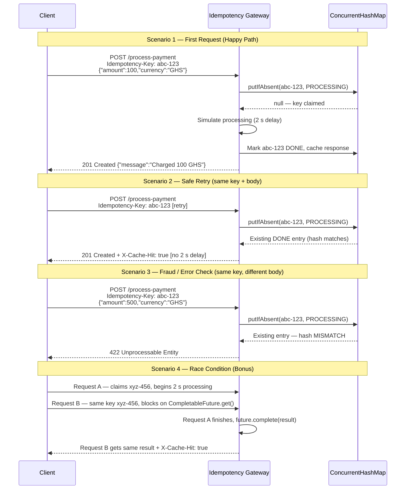

# Idempotency-Gateway — The "Pay-Once" Protocol

A Spring Boot service that guarantees every payment is processed **exactly once**, no matter how many times the client retries.

---

## Architecture Diagram



---

## Setup Instructions

### Prerequisites

- Java 17+
- Maven 3.8+

### Run

```bash
cd backend/Idempotency-gateway
mvn spring-boot:run
```

Server starts on **http://localhost:8080**

### Build executable JAR

```bash
mvn clean package
java -jar target/idempotency-gateway-0.0.1-SNAPSHOT.jar
```

---

## API Documentation

### `POST /process-payment`

Processes a payment exactly once for a given `Idempotency-Key`.

#### Request Headers

| Header            | Required | Description                                      |
|-------------------|----------|--------------------------------------------------|
| `Idempotency-Key` | Yes      | Client-generated unique key (UUID recommended)   |
| `Content-Type`    | Yes      | `application/json`                               |

#### Request Body

```json
{
  "amount": 100,
  "currency": "GHS"
}
```

| Field      | Type   | Constraints               |
|------------|--------|---------------------------|
| `amount`   | number | Required, must be positive |
| `currency` | string | Required, non-blank        |

---

#### Response — 201 Created (first request, processed)

```json
{
  "status": "success",
  "message": "Charged 100 GHS",
  "amount": 100,
  "currency": "GHS",
  "transactionId": "abc-123",
  "timestamp": "2024-06-01T12:00:02.000Z"
}
```

#### Response — 201 Created (duplicate request, replayed instantly)

Same body as the first request, plus:

```
X-Cache-Hit: true
```

No 2-second delay on cached responses.

#### Response — 422 Unprocessable Entity (same key, different body)

```json
{
  "status": 422,
  "error": "Idempotency key already used for a different request body.",
  "timestamp": "2024-06-01T12:00:05.000Z"
}
```

#### Response — 400 Bad Request (missing header)

```json
{
  "error": "Missing required header: Idempotency-Key"
}
```

---

### Example cURL Commands

**First payment:**

```bash
curl -X POST http://localhost:8080/process-payment \
  -H "Content-Type: application/json" \
  -H "Idempotency-Key: pay-$(uuidgen)" \
  -d '{"amount": 100, "currency": "GHS"}'
```

**Safe retry (same key + same body):**

```bash
curl -X POST http://localhost:8080/process-payment \
  -H "Content-Type: application/json" \
  -H "Idempotency-Key: pay-00000000-0000-0000-0000-000000000001" \
  -d '{"amount": 100, "currency": "GHS"}'
```

**Fraud / mismatch check (same key, higher amount):**

```bash
curl -X POST http://localhost:8080/process-payment \
  -H "Content-Type: application/json" \
  -H "Idempotency-Key: pay-00000000-0000-0000-0000-000000000001" \
  -d '{"amount": 500, "currency": "GHS"}'
```

---

## Design Decisions

### Atomic Key Claiming — `ConcurrentHashMap.putIfAbsent`

`putIfAbsent` is a single atomic operation. The first thread to call it for a given key succeeds (returns `null`) and owns the processing. Every subsequent caller gets the existing record back. This eliminates the need for explicit locks or `synchronized` blocks.

### Race Condition Handling — `CompletableFuture` as a Blocking Gate (Bonus Feature)

Each record in the store carries a `CompletableFuture<ProcessedPayment>`. If Request B arrives while Request A is still inside the 2-second sleep, Request B calls `future.get(30s)` and parks its thread. When Request A finishes it calls `future.complete(result)`, unblocking every waiting caller at once. They all receive `X-Cache-Hit: true` without triggering a second charge.

### Developer's Choice — 24-Hour TTL with Scheduled Key Expiry

**What is it?** Every idempotency record is stamped with an expiry timestamp 24 hours in the future. A `@Scheduled` background task runs every hour and removes entries whose `expiresAt` has passed.

**Why?** Without expiry the in-memory store grows without bound — a production service processing thousands of payments per hour would eventually run out of heap. The 24-hour window comfortably covers all realistic retry scenarios (network timeouts resolve in seconds to minutes). After expiry the key is freed, allowing a client to reuse the same UUID for a brand-new transaction in a future payment session. This behaviour matches Stripe's idempotency key specification.
